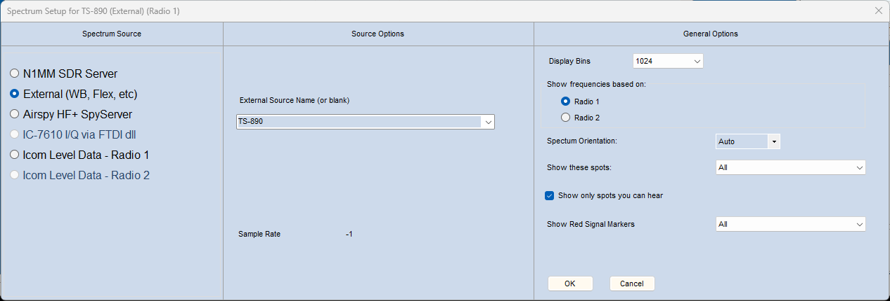
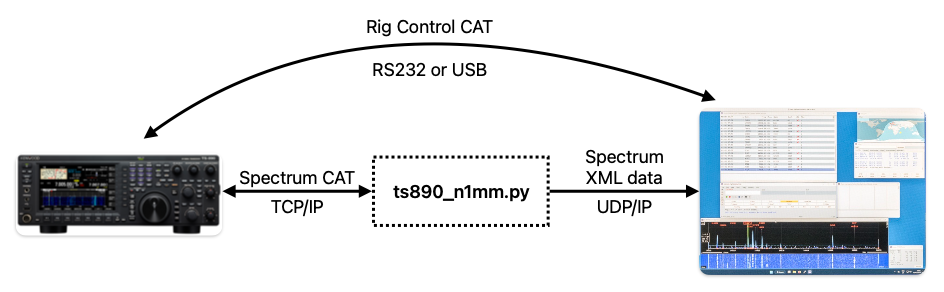

# ts890-n1mm-spectrum


This is a Python script to read band scope data from a network connected Kenwood TS-890S and send it formatted as spectrum data to N1MM+ logger. It allows the user to see the TS-890's bandscope in a N1MM spectrum display window with spots overlaid:


## Requirements

This is a self contained Python 3 script that should run without the need to install any extra Python modules. It has been tested on both Intel and ARM versions of MacOS Sonoma with the default Python 3.8/3.9 versions, and should run on Linux or Windows if a similar or newer Python 3 is installed.

Installation is to simply download the __ts890_n1mm.py__ file to a directory of your choice.

## Comand line options

### Minimal usage example:

```
./ts890_n1mm.py -t 192.168.1.89 -a AdminUserName -p AdminPassword -n 192.168.1.11
```

In the above example, the TS-890 has an IP address of _192.168.1.89_ and has an admin user called _AdminUserName_ with a password of _AdminPassword_. The Windows PC running N1MM+ has an IP address of _192.168.1.11_.

### Options format

This script accepts either shortform (e.g. _-t_) or longform (e.g. _--ts890_) command line options. There's no functional difference, it's just a personal preference.

The alternative longform option version of the previous example would be:

```
./ts890_n1mm.py --ts890 192.168.1.89 --admin AdminUserName --password AdminPassword --n1mm 192.168.1.11
```

### Displaying help

Use the _--help_ command line option to list all options:

```
./ts890_n1mm.py --help
usage: ts890_n1mm.py [-h] -t <host or addr> -p <password> (-a <admin account> | -u <user account>) [-n <host or addr>]

Script to read bandscope data from a TS-890S and send it to N1MM+ logger.

optional arguments:
  -h, --help            show this help message and exit

TS-890 options:
  -t <host or addr>, --ts890 <host or addr>
                        TS-890 IP address or hostname
  -p <password>, --password <password>
                        TS-890 account password

Specify either an admin or user account for the TS-890:
  -a <admin account>, --admin <admin account>
                        TS-890 admin account name
  -u <user account>, --user <user account>
                        TS-890 user account name

N1MM options:
  -n <host or addr>, --n1mm <host or addr>
                        N1MM IP address or hostname
```

### Loading arguments from a file

Command line options can be placed in a text file and loaded using the '@' argument, e.g:

```
./ts890_n1mm.py @my_config.cfg
```

Where _my_config.cfg_ for the previous example would be:

```
--ts890=192.168.1.89
--admin=AdminUserName
--password=AdminPassword
--n1mm=192.168.1.11
```

Note: the Python ArgParse module is a little fussy and so each option must be on a new line and use the _--option=value_ format with an equals sign and no whitespace.

# N1MM Configuration

This script uses a separate (LAN) connection to the TS-890 to retrieve the spectrum data, so you can keep your existing N1MM rig control unmodified using RS232 or USB. The only configuration required in N1MM is for the Spectrum Display window itself. Click the little arrow on the righthand side of the Spectrum Display to bring up its configuration window:



The important setting is the _Spectrum Source_ which must be set to _External (WB, Flex, etc)_ in order to enable the XML interface.

The XML data source name is _TS-890_ and I would recommend _Display Bins_ to be set to _1024_, the TS-890 spectrum is 640 points across and N1MM will handle the difference itself.

The complete connection picture including the existing rig control is therefore:




# License

This software is offered free of charge with no warranty or liability and is licensed under the permissive open source MIT license.

Copyright (c) 2024 Jonathan Perkins G4IVV.
